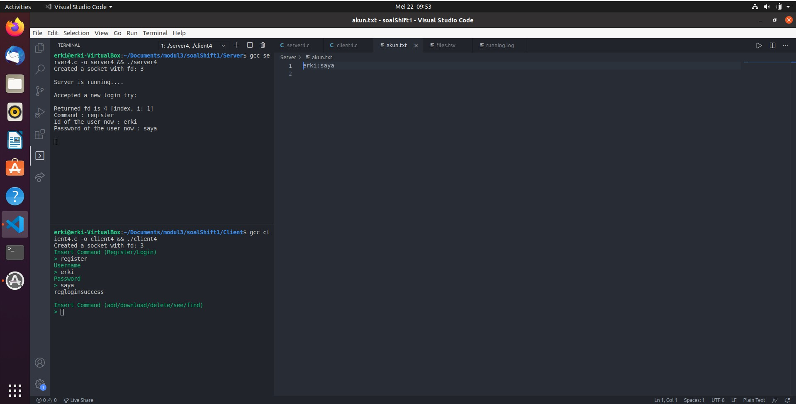
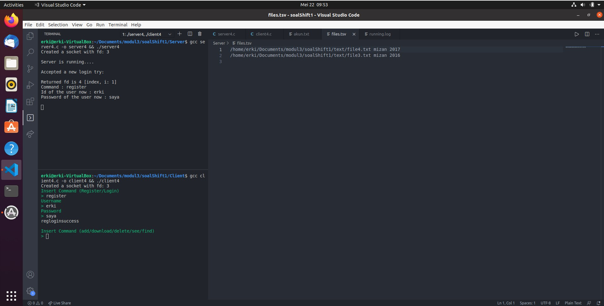
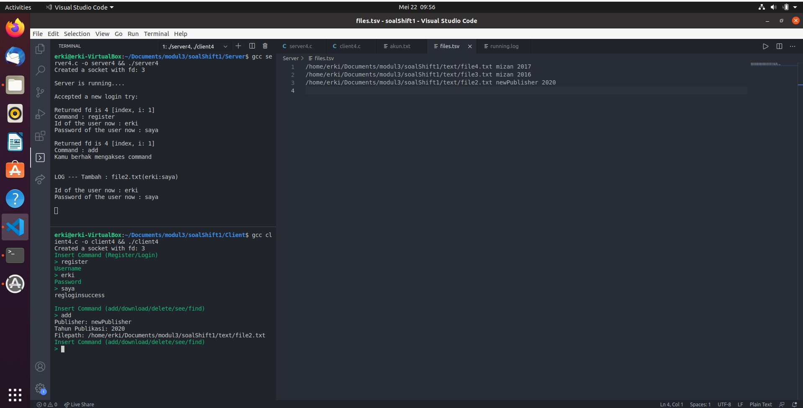
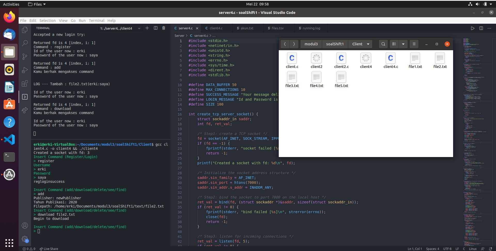
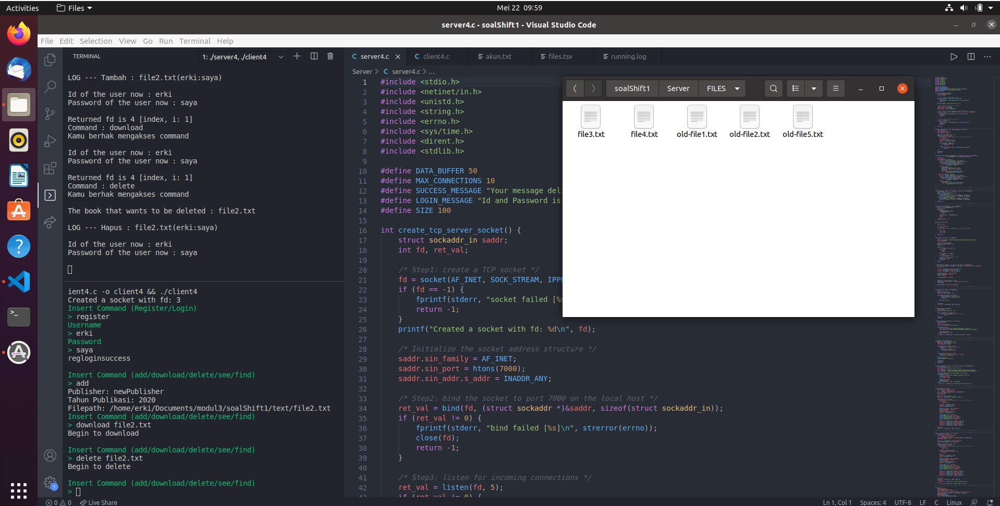
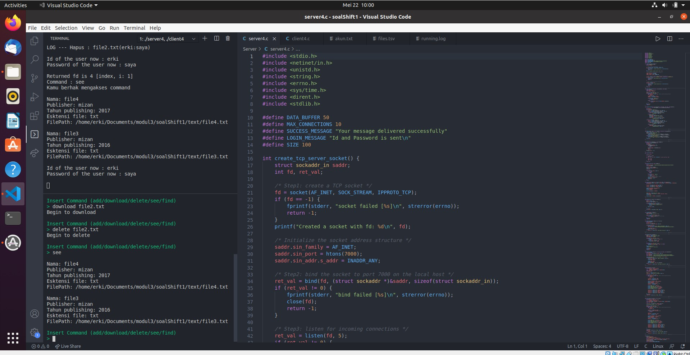
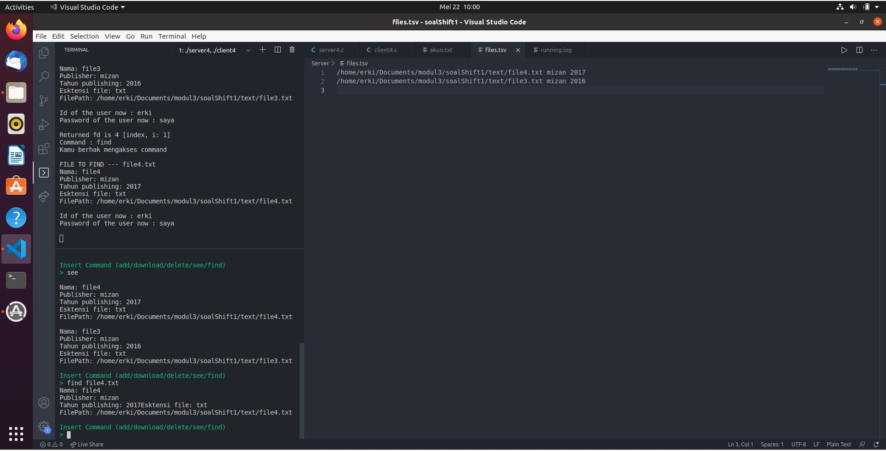
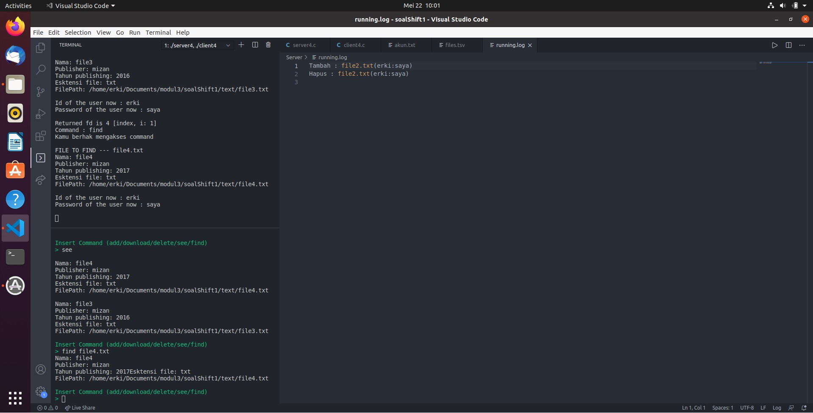

# sisop-shift-sisop-modul-3-A01-2021

## Soal Nomor 1

Keverk adalah orang yang cukup ambisius dan terkenal di angkatannya. Sebelum dia menjadi ketua departemen di HMTC, dia pernah mengerjakan suatu proyek dimana keverk tersebut meminta untuk membuat server database buku. Proyek ini diminta agar dapat digunakan oleh pemilik aplikasi dan diharapkan bantuannya dari pengguna aplikasi ini.

Di dalam proyek itu, Keverk diminta:

a. Pada saat client tersambung dengan server, terdapat dua pilihan pertama, yaitu register dan login. Jika memilih register, client akan diminta input id dan passwordnya untuk dikirimkan ke server. User juga dapat melakukan login. Login berhasil jika id dan password yang dikirim dari aplikasi client sesuai dengan list akun yang ada didalam aplikasi server. Sistem ini juga dapat menerima multi-connections. Koneksi terhitung ketika aplikasi client tersambung dengan server. Jika terdapat 2 koneksi atau lebih maka harus menunggu sampai client pertama keluar untuk bisa melakukan login dan mengakses aplikasinya. Keverk menginginkan lokasi penyimpanan id dan password pada file bernama **akun.txt** dengan format :
`akun.txt`

```
id:password
id2:password2
```

b. Sistem memiliki sebuah database yang bernama **files.tsv.** Isi dari **files.tsv** ini adalah **path file saat berada di server**, **publisher**, dan **tahun publikasi**. Setiap penambahan dan penghapusan file pada folder file yang bernama FILES pada server akan memengaruhi isi dari **files.tsv**. Folder **FILES** otomatis dibuat saat server dijalankan.

c. Tidak hanya itu, Keverk juga diminta membuat fitur agar client dapat menambah file baru ke dalam server. Direktori **FILES** memiliki struktur direktori di bawah ini : <br />

Direktori **FILES**

```
File1.ekstensi
File2.ekstensi
```

Pertama client mengirimkan input ke server dengan struktur sebagai berikut :<br />
Contoh Command Client :

```
add
```

Output Client Console:

```
Publisher:
Tahun Publikasi:
Filepath:
```

Kemudian, dari aplikasi client akan dimasukan data buku tersebut (perlu diingat bahwa Filepath ini merupakan **path file yang akan dikirim ke server**). Lalu client nanti akan melakukan pengiriman file ke aplikasi server dengan menggunakan socket. Ketika file diterima di server, maka row dari files.tsv akan bertambah sesuai dengan data terbaru yang ditambahkan.

d. Dan client dapat mendownload file yang telah ada dalam folder FILES di server, sehingga sistem **harus** dapat mengirim file ke client. Server harus melihat dari files.tsv untuk melakukan pengecekan apakah file tersebut valid. Jika tidak valid, maka mengirimkan pesan error balik ke client. Jika berhasil, file akan dikirim dan akan diterima ke client di **folder client** tersebut.

Contoh Command client

```
download TEMPfile.pdf
```

e. Setelah itu, client juga dapat menghapus file yang tersimpan di server. Akan tetapi, Keverk takut file yang dibuang adalah file yang penting, maka file hanya akan diganti namanya menjadi ‘old-NamaFile.ekstensi’. Ketika file telah diubah namanya, maka row dari file tersebut di file.tsv akan terhapus.

Contoh Command client

```
delete TEMPfile.pdf
```

f. Client dapat melihat semua isi **files.tsv** dengan memanggil suatu perintah yang bernama see. Output dari perintah tersebut keluar dengan format.

Contoh Command client

```
see
```

Contoh Format Output pada Client:

```
Nama:
Publisher:
Tahun publishing:
Ekstensi File :
Filepath :

Nama:
Publisher:
Tahun publishing:
Ekstensi File :
Filepath :
```

g. Aplikasi client juga dapat melakukan pencarian dengan memberikan suatu string. Hasilnya adalah semua nama file yang mengandung string tersebut. Format output seperti format output f.

Contoh Client Command:

```
find TEMP
```

h. Dikarenakan Keverk waspada dengan pertambahan dan penghapusan file di server, maka Keverk membuat suatu log untuk server yang bernama **running.log**. Contoh isi dari log ini adalah

**running.log**

```
Tambah : File1.ektensi (id:pass)
Hapus : File2.ektensi (id:pass)

```

## Solusi

### No 1a

Untuk soal ini, terdapat tiga task utama yang program harus dapat tangani. Yang pertama adalah menangani login dan register dari pengguna dan yang kedua adalah sistem dapat menghandle multiconnections. Jika seorang client sedang tersambung dengan server dan ada client lain yang mencoba untuk terhubung dengan server, maka ia harus menunggu sampai client pertama melakukan logout (terminate program).

Untuk menghandle sistem multiconnection, maka program akan menggunakan sistem select-server. Untuk menerapkan sistem seperti `queue`, maka dilakukan sedikit modifikasi seperti berikut

**server.c**

```c
..............
..............
..............

int main () {
        .....
        int userLoggedIn = 0;
        .....

        /* Invoke select() and then wait! */
        ret_val = select(FD_SETSIZE, &read_fd_set, NULL, NULL, NULL);

        /* select() woke up. Identify the fd that has events */
        if (ret_val >= 0 ) {
            /* Check if the fd with event is the server fd */
            if (FD_ISSET(server_fd, &read_fd_set)) {
                /* accept the new connection */
                new_fd = accept(server_fd, (struct sockaddr*)&new_addr, &addrlen);
                if (new_fd >= 0) {
                    printf("Accepted a new login try:\n\n");
                    for (i=0;i < MAX_CONNECTIONS;i++) {
                        if (all_connections[i] < 0) {
                            all_connections[i] = new_fd;
                            if(i != serving) {
                                ret_val1 = send(all_connections[i], "wait",  SIZE, 0);
                            } else {
                                ret_val1 = send(all_connections[i], "serve",  SIZE, 0);
                            }
                            break;
                        }
                    }
                } else {
                    fprintf(stderr, "accept failed [%s]\n", strerror(errno));
                }
                ret_val--;
                if (!ret_val) continue;
            }

            /* Check if the fd with event is a non-server fd */
            // step2
            for (i=1;i < MAX_CONNECTIONS;i++) {
                if ((all_connections[i] > 0) &&
                    (FD_ISSET(all_connections[i], &read_fd_set))) {
                    // read command from client
                    ret_val3 = recv(all_connections[i], cmd, sizeof(cmd), 0);
                    printf("Returned fd is %d [index, i: %d]\n", all_connections[i], i);
                    printf("Command : %s\n", cmd);

                    //check if client terminate
                    if (ret_val1 == 0 || ret_val2 == 0 || ret_val3 == 0) {
                        printf("Id of the user now : %s\n", id);
                        printf("Password of the user now : %s\n", password);
                        printf("Closing connection for fd:%d\n\n", all_connections[i]);
                        close(all_connections[i]);
                        all_connections[i] = -1; /* Connection is now closed */

                        //make another client wait while a client is loggein
                        while(1) {
                            if(serving == 9) {
                                serving = 1;
                                break;
                            }
                            if(all_connections[serving + 1] != -1) {
                                serving++;
                                break;
                            }
                            serving++;
                        }
                        userLoggedIn = 0;
                        if(all_connections[serving] != -1)
                            status_val = send(all_connections[serving], "serve",  SIZE, 0);
                    }
                    .......
            }
		}
    }

   ......
}

```

**client.c**

```c
int main () {
    ........
    while(strcmp(message, "wait") == 0) {
        printf("\e[31mServer is full!\e[0m\n");
        ret_val = recv(fd, message, SIZE_BUF, 0);
    }
    ........
}
```

pada kepingan kode diatas, server dapat menghandle multi-connection queue dengan menggunakan serving dan wait. Terdapat array dengan kapasitas 10 untuk menyimpan maksimum jumlah client dalam satu waktu, lalu terdapat variabel serving untuk melakukan counting terhadap client ke-berapa yang sedang tersambung dengan sistem. Jika terdapat client yang sedang tersambung, dan client lain mencoba tersambung ke sistem, maka server akan mengirimkan pesan `wait` kepada client tersebut

Untuk menghandle sistem login dan register, dapat dilihat di kodingan di bawah ini

**server.c**

```c
/*------------------------------------------------------------- NO 1A -------------------------------------------------------------*/
int check_IdPassword(char id[], char password[], char cmd[]){
	char line[512];
	const char delim[2] = ":";
	char *tempId, *tempPass;

	FILE *fp = fopen("akun.txt", "r");
	while(fgets(line, 512, fp)){
		char *newline = strchr( line, '\n' ); //getrid god dang newline
		if ( newline )
			*newline = 0;
		tempId = strtok(line, delim);
		tempPass = strtok(NULL, delim);

		if(!strcmp(cmd, "register")){
			if(!strcmp(tempId, id))
				return 1;
		}else{
			if(!strcmp(tempId, id) && !strcmp(tempPass, password))
				return 1;
		}
	}
	fclose(fp);
	return 0;
}

void register_login(int all_connections_i, char cmd[], char id[], char password[],
                    int *userLoggedIn, int all_connections_serving ){
    int ret_val;
    int status_val;
    if(!strcmp(cmd, "register")) {
        ret_val = recv(all_connections_i, id, SIZE, 0);
        ret_val = recv(all_connections_i, password, SIZE, 0);
        if(check_IdPassword(id, password, cmd)) {
            status_val = send(all_connections_serving,
                    "userfound\n", SIZE, 0);
        } else {
            *userLoggedIn = 1;
            FILE *app = fopen("akun.txt", "a+");
            fprintf(app, "%s:%s\n", id, password);
            fclose(app);
            status_val = send(all_connections_serving,
                    "regloginsuccess\n", SIZE, 0);
        }
    } else if(!strcmp(cmd, "login")) {
        ret_val = recv(all_connections_i, id, SIZE, 0);
        ret_val = recv(all_connections_i, password, SIZE, 0);
        if(!check_IdPassword(id, password, cmd))
            status_val = send(all_connections_serving,
                    "wrongpass\n", SIZE, 0);
        else {
            *userLoggedIn = 1;
            status_val = send(all_connections_serving,
                    "regloginsuccess\n", SIZE, 0);
        }
    }
}
/*------------------------------------------------------------- END NO 1A -------------------------------------------------------------*/

..............
..............
..............


int main () {
        .....
        if(access("akun.txt", F_OK ) != 0 ) {
            FILE *fp = fopen("akun.txt", "w+");
            fclose(fp);
	    }
        int userLoggedIn = 0;
        .....

       if (ret_val3 > 0) {
                        // signing up
                        if(!strcmp(cmd, "register") || !strcmp(cmd, "login"))
                              register_login(all_connections[i], cmd, id, password, &userLoggedIn,
                                            all_connections[serving] );
                        // other command
                        else {
                           ........
                           ........
                        }
                        ...........
                    }

   ......
}

```

**client.c**

```c
int main () {
    ........
    int commandTrue = 0;
    while(1)
    {
        // sign up user
        while(!commandTrue) {
            printf("\e[32mInsert Command (Register/Login)\n>\e[0m ");
            scanf("%s", cmd);
            int b=0;
            for(b=0;b<strlen(cmd);b++){
                cmd[b] = tolower(cmd[b]);
            }
            ret_val = send(fd, cmd, SIZE_BUF, 0);
            if(!strcmp(cmd, "register") || !strcmp(cmd, "login")) {
                if(register_login(fd, cmd))
                    commandTrue = 1;
            } else {
                ret_val = recv(fd, message, SIZE_BUF, 0);
                if(!strcmp(message, "notlogin\n")) {
                    printf("TOLONG REGISTER/ LOGIN DULU Y\n\n");
                } else {
                    commandTrue = 1;
                }
            }
        }
    ........
}
```

Pada kepingan kode diatas, pada saat program dijalankan, program akan meminta login atau register terlebih dahulu. Jika client mencoba untuk mengakses command lainnya, sistem akan memberikan pesan kepada client untuk melakukan signin terlebih dahulu. Program juga akan melakukan pengecekan untuk username yang sama saat client akan melakukan register dan pengecekan id dan password yang sesuai saat client melakukan login. Program akan terus meminta client untuk melakukan antara kedua hal tersebut hingga salah satu dari kedua perintah diatas berhasil dilakukan. Setelah berhasil, client akan dapat mengakses command lainnya di program ini. Untuk pembuatan database **akun.txt**, server akan melakukan pengecekan apakah sudah terdapat file tersebut. Jika tidak, maka file baru akan dibuat..

### Screenshot pengerjaan no 1A


### No 1b

Untuk soal ini, program akan membuat sebuah database bernama **file.tsv** yang akan menyimpan path, publisher, dan tahun dari file yang akan dimasukkan ke dalam sistem. Database ini akan dijadikan acuan saat dilakukan perpindahan file (download, upload, dan delete) di sistem.

### Screenshot pengerjaan no 1B


**server.c**

```c
int main(){
    ........
    if(access("files.tsv", F_OK ) != 0 ) {
		FILE *fp = fopen("files.tsv", "w+");
		fclose(fp);
	}
    .........
}
```

Untuk pembuatan database **files.tsv**, akan dilakukan pada saat awal program server dijalankan. Program server akan melakukan pengecekan apakan sudah terdapat database **files.tsv** pada saat pertama kali dijalankan, jika belum maka akan dibuat database tersebut.

### No 1c

Untuk soal ini, program memungkinkan client agar dapat menambah file baru ke dalam server. Untuk pengimplementasiannya dapat dilihat di

**server.c**

```c
/*------------------------------------------------------------- NO 1C -------------------------------------------------------------*/
 void getDir(char filePathDir[], char fileName[]){
    int len = strlen(filePathDir)-1;
    int index = 0;
    while(len){
        filePathDir[len+1] = '\0';
        if(filePathDir[len]=='/'){
            break;
        }
        fileName[index] = filePathDir[len];
        len--;
        index++;
    }
	fileName[index] = '\0';
}

char *strrev(char *str)
{
    char *p1, *p2;

    if (! str || ! *str)
        return str;
    for (p1 = str, p2 = str + strlen(str) - 1; p2 > p1; ++p1, --p2)
    {
        *p1 ^= *p2;
        *p2 ^= *p1;
        *p1 ^= *p2;
    }
    return str;
}

void write_file(int fd, char fileName[]){
    int n;
    char fullPath[100] = "/home/erki/Documents/modul3/soalShift1/Server/FILES/";
    char buffer[SIZE];

    strcat(fullPath, fileName);
    FILE *fp = fopen(fullPath, "w");
    fclose(fp);

    while (1) {
        n = recv(fd, buffer, SIZE, 0);
        if (n <= 0){
            break;
            return;
        }
        if(!strcmp(buffer, "done"))
            return;
        fp = fopen(fullPath, "a");
        // printf("WRITING --- %s\n", buffer);
        fprintf(fp, "%s", buffer);
        bzero(buffer, SIZE);
        fclose(fp);
    }
    return;
}

void add_books(int send_clt, int rcv_clt, char id[], char password[]){
	char publisher[SIZE], tahun[SIZE], filePath[SIZE],  filePathDir[SIZE], fileName[15];
	int ret_val;

	ret_val = recv(send_clt, publisher, SIZE, 0);
	ret_val = recv(send_clt, tahun, SIZE, 0);
	ret_val = recv(send_clt, filePath, SIZE, 0);

	sprintf(filePathDir, "%s", filePath);
	getDir(filePathDir, fileName);
	strrev(fileName);

	write_file(send_clt, fileName);


	FILE *temp = fopen("files.tsv", "a+");
	fprintf(temp, "%s\t%s\t%s\n", filePath, publisher, tahun);
	fclose(temp);

	make_log("add", fileName, id, password);
}
/*------------------------------------------------------------- END NO 1C-------------------------------------------------------------*/

```

**client.c**

```c
void sendFile(int sockfd, char filePath[]){
    int n;
    char data[SIZE_BUF] = {0};
    FILE *fp = fopen(filePath, "r");

    while(fgets(data, SIZE_BUF, fp) != NULL) {
        if (send(sockfd, data, sizeof(data), 0) == -1) {
            perror("[-]Error in sending file.");
            exit(1);
        }
        bzero(data, SIZE_BUF);
    }

    fclose(fp);
    int ret_val = send(sockfd, "done", SIZE_BUF, 0);
}

void add_books(int fd){
    int ret_val;
    char publisher[SIZE_BUF], tahun[SIZE_BUF], filePath[SIZE_BUF];

    printf("Publisher: ");
    scanf("%s", publisher);
    ret_val = send(fd, publisher, SIZE_BUF, 0);

    printf("Tahun Publikasi: ");
    scanf("%s", tahun);
    ret_val = send(fd, tahun, SIZE_BUF, 0);

    printf("Filepath: ");
    scanf("%s", filePath);
    ret_val = send(fd, filePath, SIZE_BUF, 0);

    sendFile(fd, filePath);
}
```

Pada kepingan kode diatas, client akan mengirimkan informasi berupa publisher, tahun publikasi, dan juga path untuk file yang akan diupload. Ketika informasi tersebut diterima oleh server, maka akan dilakukan pengecekan apakah path yang dikirimkan oleh client itu benar adanya. Jika benar, maka client akan mengirimkan file dengan cara dilakukan **read** per line dari file yang akan dikirimkan dan server akan membuat file dengan nama dan isi yang sesuai di folder **FILES** dan jika tidak, maka akan dikirimkan pesan ke client bahwa file yang akan diupload tidak ada. Setelah transfer data dan pembuatan file selesai, maka row baru akan ditambahkan di **files.tsv** dengan format `FILEPATH (tab) PUBLISHER (tab) TAHUN`. Untuk setiap penambahan sukses file ke dalam sistem, maka akan dicatat di dalam **running.log**, log yang dicatat berupa informasi penambahan, nama file, id, dan password yang menambahkan file ke dalam server.

### Screenshot pengerjaan no 1C


### No 1d

Untuk soal ini, program memungkinkan client agar dapat mendownload file yang telah ada di server dalam folder **FILES**. Folder yang didownload akan disimpan dalam folder client. Untuk pengimplementasiannya dapat dilihat di bawah ini.

**server.c**

```c
/*------------------------------------------------------------- NO 1D -------------------------------------------------------------*/
 void sendFile(int sockfd, char filePath[]){
    int n;
    char data[SIZE] = {0};
    FILE *fp = fopen(filePath, "r");

    while(fgets(data, SIZE, fp) != NULL) {
        if (send(sockfd, data, SIZE, 0) == -1) {
            perror("[-]Error in sending file.");
            exit(1);
        }
        bzero(data, SIZE);
    }

    fclose(fp);
    int ret_val = send(sockfd, "done", SIZE, 0);
}


int checkPath(char fileName[]){
    char temp[100];
    FILE *fp = fopen("files.tsv", "r");

    while ( fscanf(fp,"%s", temp) == 1){
        if(strstr(temp, fileName)!=0)//if match found
                return 1;
    }
    fclose(fp);
    return 0;
}

void download_books(int send_clt, int rcv_clt){
	char books[SIZE];
	int line = 1;
	int ret_val, status_val;
	ret_val = recv(send_clt, books, SIZE, 0);

	if(checkPath(books)){
		status_val = send(rcv_clt, "Begin to download\n", SIZE, 0);
		char temp[SIZE] = "/home/erki/Documents/modul3/soalShift1/Server/FILES/";

		strcat(temp, books);
		sendFile(send_clt, temp);
	} else {
		status_val = send(rcv_clt, "File does not exist\n", SIZE, 0);
	}
}
/*------------------------------------------------------------- END NO 1D-------------------------------------------------------------*/

```

**client.c**

```c
void write_file(int fd, char fileName[]){
    int n;
    char buffer[SIZE_BUF];

    FILE *fp = fopen(fileName, "w");
    fclose(fp);

    while (1) {
        n = recv(fd, buffer, SIZE_BUF, 0);
        if (n <= 0){
            break;
            return;
        }
        if(!strcmp(buffer, "done"))
            return;
        fp = fopen(fileName, "a");
        // printf("DATA --- %s\n", buffer);
        fprintf(fp, "%s", buffer);
        bzero(buffer, SIZE_BUF);
        fclose(fp);
    }
    return;
}

void download_books(int fd){
    int ret_val;
    char books[SIZE_BUF], message[SIZE_BUF];

    scanf("%s", books);
    ret_val = send(fd, books, SIZE_BUF, 0);

    ret_val = recv(fd, message, SIZE_BUF, 0);
    puts(message);

    if(!strcmp(message, "Begin to download\n"))
		write_file(fd, books);
}
```

Pada kepingan kode diatas, client akan mengirimkan informasi berupa nama file yang akan didownload. Saat informasi terebut diterima oleh server, maka dilakukan pengecekan pada **files.tsv** apakah terdapa file yang ingin didownload. Jika tidak, maka server akan mengirimkan pesan bahwa file yang ingin didownload tidak ada. Jika ada, maka server akan mengirimkan isi file per line dan pada pihak client akan dilakukan pembuatan file pada folder client dan penerimaan data per line hingga EOF.

### Screenshot pengerjaan no 1D


### No 1e

Untuk soal ini, program memungkinkan client agar dapat menghapus file yang terdapat di dalam server. Pada saat file di dalam server akan dihapus, maka row informasi tentang file tersebut di dalam database **files.tsv** akan hilang. Namun, file di dalam folder FILES hanya akan diubah namannya menjadi old-namefile.extension. Untuk pengimplementasiannya dapat dilihat di bawah ini

**server.c**

```c
/*------------------------------------------------------------- NO 1E -------------------------------------------------------------*/
int deleteTsv(char filename[]) {
    FILE *tsv = fopen("files.tsv", "r+");
    FILE *tmp = fopen("temp.tsv", "w+");
    char temp[256], line[256];

	while(fgets(line, 256, tsv) != 0){
        if(sscanf(line, "%255[^\n]", temp) != 1)
			break;
        if(strstr(temp, filename) == 0)
            fprintf(tmp, "%s\n", temp);
    }

    while(fgets(line, 256, tsv) != 0){
        if(sscanf(line, "%255[^\n]", temp) != 1) break;
        fprintf(tsv, "%s\n", temp);
    }
    remove("files.tsv");
    rename("temp.tsv", "files.tsv");

    fclose(tmp);
    fclose(tsv);
    return 0;
}

void delete_books(int send_clt, int rcv_clt, char id[], char password[]){
	char books[SIZE];
	int ret_val1 = recv(send_clt, books, SIZE, 0);
	int  status_val;
	char temp[SIZE] = "/home/erki/Documents/modul3/soalShift1/Server/FILES/";
	char temp2[120] = "/home/erki/Documents/modul3/soalShift1/Server/FILES/old-";

	printf("The book that wants to be deleted : %s\n", books);
	if(checkPath(books)){
	    status_val = send(rcv_clt, "Begin to delete\n", SIZE, 0);
	    strcat(temp, books);
	    strcat(temp2, books);

	    rename(temp, temp2);
	    deleteTsv(books);
		make_log("delete", books, id, password);
	}else
	    status_val = send(rcv_clt, "File does not exist\n", SIZE, 0);
}
/*------------------------------------------------------------- END NO 1E-------------------------------------------------------------*/

```

**client.c**

```c
void delete_books(int fd){
    int ret_val;
    char books[SIZE_BUF], message[SIZE_BUF];

    scanf("%s", books);
    ret_val = send(fd, books, SIZE_BUF, 0);

    ret_val = recv(fd, message, SIZE_BUF, 0);
    puts(message);

}
```

Pada kepingan kode diatas, client akan mengirimkan informasi berupa nama file yang akan dihapus. Setelah server menerima nama file tersebut, maka akan dilakukan pengecekan di dalam **files.tsv** apakah terdapat nama file tersebut di dalam server. Jika ada, maka isi dari folder **files.tsv** selain row yang terdapat nama file tersebut akan dicopy ke dalam file **temp.tsv**. Setelah selesai, file **files.tsv** akan dihapus dan file **temp.tsv** akan direname menjadi **files.tsv**. Setelah itu, file di dalam server akan diubah namanya menjadi `old-namefile.extension`. Terakhir, akan dibuat log pada file **running.log** yang akan berisi informasi penghapusan, nama file yang dihapus, id, dan password client yang melakukan penghapusan file.

### Screenshot pengerjaan no 1E


### No 1f

Untuk soal ini, program memungkinkan client agar dapat melihat semua isi di dalam database **files.tsv**. Isi dari database disajikan dalam format tertentu yaitu terdapat nama file, publisher, tahun publishing, ekstensi file, dan filepath

**server.c**

```c
/*------------------------------------------------------------- NO 1F -------------------------------------------------------------*/
void see_books(int rcv_clt){
	char *publisher, *tahun, *filePath,
			*nameFile, *ekstensi;
	char  line[512], filePathDir[SIZE], tempName[SIZE];
	const char tab[2] = "\t";
	int status_val;

	FILE *fp = fopen("files.tsv", "r");
	status_val = send(rcv_clt, "not-done", SIZE, 0);

	while(fgets(line, 512, fp)){
		char *newline = strchr( line, '\n' ); //getrid god dang newline
		if ( newline )
			*newline = 0;

		filePath = strtok(line, tab);
		publisher = strtok(NULL, tab);
		tahun = strtok(NULL, tab);

		sprintf(filePathDir, "%s", filePath);
		getDir(filePathDir, tempName);
		strrev(tempName);
		nameFile = strtok(tempName, ".");
		ekstensi = strtok(NULL, ".");

		printf("Nama: %s\n", nameFile);
		printf("Publisher: %s\n", publisher);
		printf("Tahun publishing: %s\n", tahun);
		printf("Esktensi file: %s\n", ekstensi);
		printf("FilePath: %s\n\n", filePath);

		status_val = send(rcv_clt, nameFile, SIZE, 0);
		status_val = send(rcv_clt, publisher, SIZE, 0);
		status_val = send(rcv_clt, tahun, SIZE, 0);
		status_val = send(rcv_clt, ekstensi, SIZE, 0);
		status_val = send(rcv_clt, filePath, SIZE, 0);
	}
	fclose(fp);
	status_val = send(rcv_clt, "done", SIZE, 0);
}
/*------------------------------------------------------------- END NO 1F-------------------------------------------------------------*/

```

**client.c**

```c
void see_books(int fd){
    int ret_val;
    char temp[SIZE_BUF], flag[100];
    int loop = 1;

    ret_val = recv(fd, flag, SIZE_BUF, 0);
    // printf("%s\n", flag);
    puts("");
    while(loop){
        ret_val = recv(fd, temp, SIZE_BUF, 0);
        if(strstr(temp, "done") != NULL){
            loop = 0;
            break;
        }
        printf("Nama: %s\n", temp);

        ret_val = recv(fd, temp, SIZE_BUF, 0);
        printf("Publisher: %s\n", temp);

        ret_val = recv(fd, temp, SIZE_BUF, 0);
        printf("Tahun publishing: %s\n", temp);

        ret_val = recv(fd, temp, SIZE_BUF, 0);
        printf("Esktensi file: %s\n", temp);

        ret_val = recv(fd, temp, SIZE_BUF, 0);
        printf("FilePath: %s\n\n", temp);

    }
}
```

Pada kepingan kode diatas, server akan memfetch per line isi **files.tsv**. Lalu, untuk setiap row, newline akan dihilangkan agar token tidak ada yang mengandung newline ("\n"). Setelah itu, dilakukan strtok untuk memisahkan nama file, tahun, publisher, dan ekstensi. Server akan mengirim semua informasi tersebut dan ditampilkan pada sisi client dengan format sesuai yang telah ditentukan.

### Screenshot pengerjaan no 1F


### No 1g

Untuk soal ini, program memungkinkan client agar dapat mencari informasi mengenai file tertentu. Informasi yang diberikan adalah nama file, publisher, tahun, ekstensi file, dan path dari file yang ada di server. Untuk pengimplementasiannya dapat dilihat di bawah ini

**server.c**

```c
/*------------------------------------------------------------- NO 1G -------------------------------------------------------------*/
void find_books(int send_clt, int rcv_clt){
	int status_val, found = 0;
    char *publisher, *tahun, *filePath,
			*nameFile, *ekstensi;
	char bookFind[SIZE], line[512], filePathDir[SIZE], tempName[SIZE];
	const char tab[2] = "\t";

    status_val = recv(send_clt, bookFind, SIZE, 0);
    printf("FILE TO FIND --- %s\n", bookFind);

    FILE *fp = fopen("files.tsv", "r");
    while(fgets(line, 512, fp)){
        char *newline = strchr( line, '\n' ); //getrid god dang newline
		if ( newline )
			*newline = 0;

		filePath = strtok(line, tab);
        if(strstr(filePath, bookFind) == 0)
            continue;

        found = 1;
		publisher = strtok(NULL, tab);
		tahun = strtok(NULL, tab);

		sprintf(filePathDir, "%s", filePath);
		getDir(filePathDir, tempName);
		strrev(tempName);
		nameFile = strtok(tempName, ".");
		ekstensi = strtok(NULL, ".");

		printf("Nama: %s\n", nameFile);
		printf("Publisher: %s\n", publisher);
		printf("Tahun publishing: %s\n", tahun);
		printf("Esktensi file: %s\n", ekstensi);
		printf("FilePath: %s\n\n", filePath);

		status_val = send(rcv_clt, nameFile, SIZE, 0);
		status_val = send(rcv_clt, publisher, SIZE, 0);
		status_val = send(rcv_clt, tahun, SIZE, 0);
		status_val = send(rcv_clt, ekstensi, SIZE, 0);
		status_val = send(rcv_clt, filePath, SIZE, 0);
    }

    fclose(fp);
	status_val = send(rcv_clt, "done", SIZE, 0);
    if(!found)
        status_val = send(rcv_clt, "file not found", SIZE, 0);
    else
        status_val = send(rcv_clt, "ketemu  hehe", SIZE, 0);
}
/*------------------------------------------------------------- END NO 1G-------------------------------------------------------------*/

```

**client.c**

```c
void find_books(int fd){
    int ret_val;
    char nameFile[SIZE_BUF], flag[100], temp[SIZE_BUF] ;
    int loop = 1;

    scanf("%s", nameFile);
    ret_val = send(fd, nameFile, SIZE_BUF, 0);

    while(loop){
        ret_val = recv(fd, temp, SIZE_BUF, 0);
        if(strstr(temp, "done") != NULL){
            loop = 0;
            break;
        }
        printf("Nama: %s\n", temp);

        ret_val = recv(fd, temp, SIZE_BUF, 0);
        printf("Publisher: %s\n", temp);

        ret_val = recv(fd, temp, SIZE_BUF, 0);
        printf("Tahun publishing: %s", temp);

        ret_val = recv(fd, temp, SIZE_BUF, 0);
        printf("Esktensi file: %s\n", temp);

        ret_val = recv(fd, temp, SIZE_BUF, 0);
        printf("FilePath: %s\n\n", temp);

    }

    ret_val = recv(fd, flag, SIZE_BUF, 0);
    if(!strcmp(flag, "file not found"))
        printf("%s\n\n", flag);
}
```

Pada kepingan kode diatas, client akan mengirimkan sebuah string untuk acuan pencarian file. Setelah itu, server akan memfetch per row dari isi **files.tsv**. Lalu, dilakukan `strtok` untuk mendapatkan token-token yang berisi informasi yang diperlukan. Selanjutnya, digunakan `strstr` yang akan mengecek apakah nama file di **files.tsv** mengandung string yang dikirim kan oleh client. Jika tidak, maka row tersebut akan dicontinue. Jika mengandung string yang dikirimkan, maka informasi yang ada akan dikirimkan kepada client untuk ditampilkan sesuai format yang ditentukan.

### Screenshot pengerjaan no 1G


### No 1h

Untuk soal ini, program akan membuat log untuk setiap penambahan dan penghapusan file yang terdapat di server.

**server.c**

```c
/*------------------------------------------------------------- NO 1G -------------------------------------------------------------*/
void make_log(char cmd[], char fileName[], char id[], char password[]){
	printf("\nLOG --- ");
	FILE *fp = fopen("running.log", "a");
	if(!strcmp(cmd, "add")){
		printf("Tambah : %s(%s:%s)\n\n", fileName, id, password);
		fprintf(fp, "Tambah : %s(%s:%s)\n", fileName, id, password);
	}else if(!strcmp(cmd, "delete")){
		printf("Hapus : %s(%s:%s)\n\n", fileName, id, password);
		fprintf(fp, "Hapus : %s(%s:%s)\n", fileName, id, password);
	}
	fclose(fp);
}
/*------------------------------------------------------------- END NO 1G-------------------------------------------------------------*/

```

Pada kepingan kode diatas, server akan memanggil `make_log` apabila server berhasil melakukan penghapusan file dan penambahan file.

### Screenshot pengerjaan no 1H


## Soal No 3
Seorang mahasiswa bernama Alex sedang mengalami masa gabut. Di saat masa gabutnya, ia memikirkan untuk merapikan sejumlah file yang ada di laptopnya. Karena jumlah filenya terlalu banyak, Alex meminta saran ke Ayub. Ayub menyarankan untuk membuat sebuah program C agar file-file dapat dikategorikan. Program ini akan memindahkan file sesuai ekstensinya ke dalam folder sesuai ekstensinya yang folder hasilnya terdapat di working directory ketika program kategori tersebut dijalankan.

Contoh apabila program dijalankan:

```
# Program soal3 terletak di /home/izone/soal3
$ ./soal3 -f path/to/file1.jpg path/to/file2.c path/to/file3.zip
#Hasilnya adalah sebagai berikut
/home/izone
    |-jpg
        |--file1.jpg
    |-c
        |--file2.c
    |-zip
        |--file3.zip
```
a. Program menerima opsi -f seperti contoh di atas, jadi pengguna bisa menambahkan argumen file yang bisa dikategorikan sebanyak yang diinginkan oleh pengguna. 
Output yang dikeluarkan adalah seperti ini :
```
File 1 : Berhasil Dikategorikan (jika berhasil)
File 2 : Sad, gagal :( (jika gagal)
File 3 : Berhasil Dikategorikan
```
b. Program juga dapat menerima opsi -d untuk melakukan pengkategorian pada suatu directory. Namun pada opsi -d ini, user hanya bisa memasukkan input 1 directory saja, tidak seperti file yang bebas menginput file sebanyak mungkin. Contohnya adalah seperti ini:
```
$ ./soal3 -d /path/to/directory/
```
Perintah di atas akan mengkategorikan file di /path/to/directory, lalu hasilnya akan disimpan di working directory dimana program C tersebut berjalan (hasil kategori filenya bukan di /path/to/directory).
Output yang dikeluarkan adalah seperti ini :
```
Jika berhasil, print “Direktori sukses disimpan!”
Jika gagal, print “Yah, gagal disimpan :(“
```
c. Selain menerima opsi-opsi di atas, program ini menerima opsi *, contohnya ada di bawah ini:
```
$ ./soal3 \*
```
Opsi ini akan mengkategorikan seluruh file yang ada di working directory ketika menjalankan program C tersebut.

d. Semua file harus berada di dalam folder, jika terdapat file yang tidak memiliki ekstensi, file disimpan dalam folder “Unknown”. Jika file hidden, masuk folder “Hidden”.

e. Setiap 1 file yang dikategorikan dioperasikan oleh 1 thread agar bisa berjalan secara paralel sehingga proses kategori bisa berjalan lebih cepat.

##Jawaban No.3
a. Pertama-tama, program akan mendapatkan argumen dari terminal dengan kode:
`int main(int argc, char *argv[])` argumen nantinya disimpan di argv.
Kode Program untuk perintah -f adalah sebagai berikut:
```c
if(!strcmp(argv[1],"-f")){
    pthread_t tid[1000];
    for(int i = 2; i<argc ;i++){
        int error = pthread_create(&tid[i], NULL, makeMoveDir, (void *)argv[i]);
        if(error != 0){
            printf("\nCant Create Thread! : [%s]\n",strerror(error));
        }
    }

    for(int j=2; j<argc; j++){
		pthread_join(tid[j], NULL);
    }
}
```
Jadi thread akan dibuat menyesuaikan dengan jumlah argumen. Tiap argument yang berisi directory akan dipass ke fungsi thread. lalu tiap thread akan dijoin agar tidak saling bertabrakan.

Fungsi Thread + fungsi get extension:
```c
const char *get_filename(const char *filename){
    const char *dot = strrchr(filename, '/');
    if(!dot || dot == filename) return "";
    return dot + 1;
}

const char *get_filename_ext(const char *filename)
{
    const char *dot2 = strchr(filename, '.');
    if(!dot2 || dot2 == filename) return "";
    return dot2 + 1;
}

bool trig = false , trig2=false;
char folder[100];
void *makeMoveDir (void *arg)
{
    char root[100] = "/home/ahdan/Modul3";
    
    char folderPath[100]; 
    strcat(folderPath,root);
    strcat(folderPath,"/");

    char filePathOld[100]; 
    if(!trig)
        strcpy(filePathOld,arg);
    else
    {
        strcpy(filePathOld,folder);
        strcat(filePathOld,arg);
    }
    
    char ext[10];
    strcpy(ext,get_filename_ext((char *)arg));
    if(ext[0]=='\0'){
        if(strchr(arg,'.')!=NULL){
            strcat(folderPath,"Hidden");
        }
        else strcat(folderPath,"Unknown");
    }
    else{
        for(int i=0;i<strlen(ext);i++){
            ext[i] = tolower(ext[i]);
        }
        // printf("%s",ext);
        strcat(folderPath, ext);
    }   

    char filePathNew[100]; 
    strcpy(filePathNew,folderPath);
    strcat(filePathNew,"/");
    if(!trig)
        strcat(filePathNew,get_filename((char *)arg));
    else
        strcat(filePathNew,arg);
   
    DIR* dir = opendir(folderPath);
    if(!dir){
        mkdir(folderPath,0777);
    }
    int stat = rename(filePathOld,filePathNew);
    if(stat==0&&trig==false) printf("%s : Berhasil Dikategorikan\n",get_filename((char *)arg));
    else if(stat==-1&&trig==false) printf("%s : Sad, gagal :(\n",get_filename((char *)arg));
    if(stat==-1&&trig==true) trig2=true;
    // printf("%s %s %s %d",filePathOld,filePathNew,arg,stat);
}
```
fungsi `getFileName` berfungsi untuk mendapatkan nama file dari suatu string yang berisi path file Sedangkan fungsi `getFileExt` berfungsi untuk mendapatkan string extension dari string yang berisi path file.
nantinya file yang sudah diambil extensi nya akan dibuatkan folder sesuai nama ekstensinya :
```c
char filePathNew[100]; 
    strcpy(filePathNew,folderPath);
    strcat(filePathNew,"/");
    if(!trig)
        strcat(filePathNew,get_filename((char *)arg));
    else
        strcat(filePathNew,arg);
   
    DIR* dir = opendir(folderPath);
    if(!dir){
        mkdir(folderPath,0777);
    }
```
lalu setelah itu path lama dari file tersebut akan digantikan dengan path baru (file akan dipindahkan) dengan fungsi `rename()`

b.  Jika program dieksekusi dengan argumen -d pertama dilakukan kode blok berikut:
```c
trig = true;
pthread_t tid2[1000];

DIR *d;
struct dirent *dir;
if(!strcmp(argv[1],"-d"))
{
    char directory[100];
    strcpy(directory, argv[2]);

    strcpy(folder,directory);
    strcat(folder,"/");
    d = opendir(argv[2]);
}
```
Kode blok diatas berfungsi untuk membuka directory yang dipilih lalu mnegiterasi setiap file yang ada di directory tersebut. Berikut kode blok untuk mengiterasi tiap file yang terdapat di dalam directory:
```c
while ((dir = readdir(d)) && d!= NULL)
{
    if(!strcmp(dir->d_name,"Soal3.o")||!strcmp(dir->d_name,"Soal3.c")||!strcmp(dir->d_name,".")||!strcmp(dir->d_name,"..")||dir->d_type==DT_DIR)
    {
        continue;
    }

    int error = pthread_create(&tid2[i], NULL, makeMoveDir, dir->d_name);
    if(error != 0){
        printf("\nCant Create Thread! : [%s]\n",strerror(error));
    }

    i++;
}
```
lalu akan dieksekusi fungsi thread yang sudah tertera diatas. Namun karena argumen -d memindahkan file dari directory lain (bukan langsung eksplisit menyebutkan filepath nya) maka jika dijalankan -d akan menjalankan:
```c
char root[100] = "/home/ahdan/Modul3";
    
char folderPath[100]; 
strcat(folderPath,root);
strcat(folderPath,"/");

char filePathOld[100]; 
if(!trig)
    strcpy(filePathOld,arg);
else
{
    strcpy(filePathOld,folder);
    strcat(filePathOld,arg);
}
```
Kode blok diatas jika menjalankan argumen -d akan filename (karena yang dipassing ke fungsi thread adalah nama dari file beserta extensinya bukan filepathnya) maka akan diconcat ke filepath directory yang lama dulu (filepath lama disimpan di global variable) lalu baru nanti didapatkan  extensi beserta filenamenya (Proses selanjutnya sama seperti 1a). Nantinya filepath baru didapatkan dengan:
```c
    char filePathNew[100]; 
    strcpy(filePathNew,folderPath);
    strcat(filePathNew,"/");
    if(!trig)
        strcat(filePathNew,get_filename((char *)arg));
    else
        strcat(filePathNew,arg);
   
    DIR* dir = opendir(folderPath);
    if(!dir){
        mkdir(folderPath,0777);
    }
    int stat = rename(filePathOld,filePathNew);
```
program akan masuk kondisi `else`.

c. Prinsipnya sama seperti no 3b perbedaan hanya saat awal saja. Saat eksekusi argumen `\*` akan masuk blok kode  berikut:
```c
else if(argv[1][0]=='*')
{
    d = opendir("/home/ahdan/Modul3");
}
```
lalu untuk langkah-langkah selanjutnya sama seperti nomor b.

d. Jika terdapat file yang `Hidden` maka nama file tersebut pasti diawali dengan simbol `.` didepannya. Oleh karena itu untuk handle case ini digunakan pengecualin di fungsi thread:
```c
char ext[10];
strcpy(ext,get_filename_ext((char *)arg));
if(ext[0]=='\0'){
    if(strchr(arg,'.')!=NULL){
        strcat(folderPath,"Hidden");
    }
    else strcat(folderPath,"Unknown");
}
```
ada pengecualian juga jika saat memakai fungsi `getFileExt` tidak didapatkan extensi maka dapat dipastikan bahwa file tidak mempunyai ekstensi maka file tersebut termasuk kategori `Unknown`.

### Screenshot No.3
